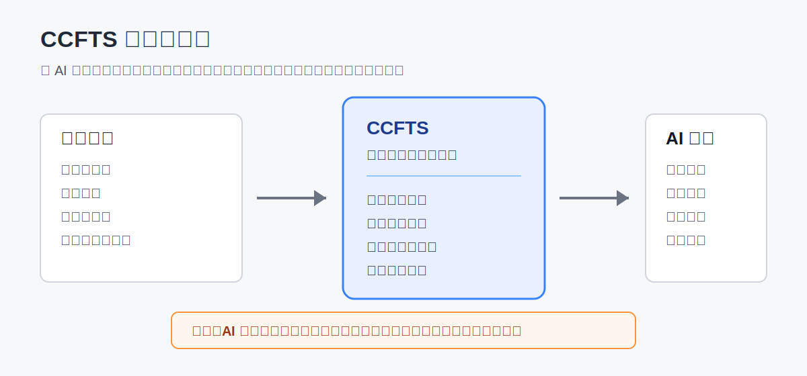
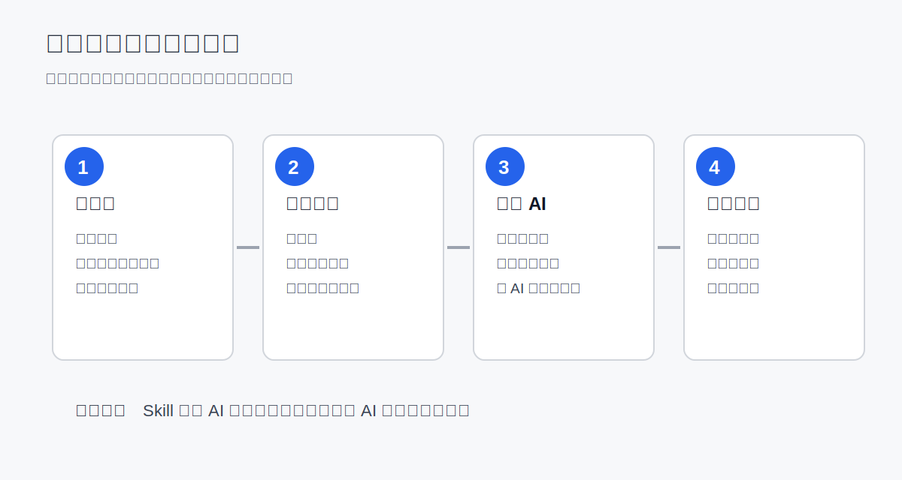
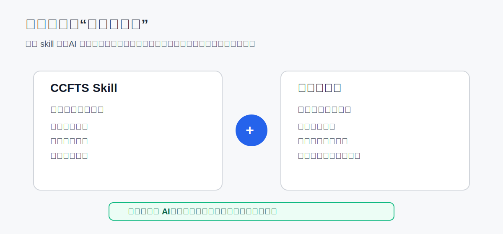

# CCFTS 中国施工企业财税 AI 技能包

[](https://github.com/philip-wong2026/china-construction-fintax-skills)
[](https://github.com/philip-wong2026/china-construction-fintax-skills/actions/workflows/validate.yml)
[](LICENSE)
[](docs/release-v0.1.0-public-alpha.md)

让 AI 先看懂施工企业的项目、合同、成本、税务和报表口径，再帮你做资料检查、风险提示和分析草稿。



## 先用一句话说清楚

CCFTS 不是财务软件，不是报税软件，也不是一个新的聊天机器人。

它是一套“给 AI 看的中国施工企业财税工作说明书”。你把它交给 AI 后，AI 在处理施工企业快报、增值税跨区域预缴、成本分析、清收清欠、质保金、竣工结算等问题时，就不再只靠通用知识临场发挥，而是先按施工企业的资料清单、业务口径和复核要求来工作。

## 为什么建筑企业需要它

建筑企业不缺资料，真正难的是口径复杂。

同一个项目，项目经理看进度、安全、质量和现金流；商务人员看合同、签证、变更和结算；财务人员看收入、成本、发票、税费和报表；公司领导看利润、两金、债权债务和经营指标。

如果 AI 只会写材料，不懂这些口径，它就容易把复杂问题说得很漂亮，但结论不敢用。

CCFTS 想解决的就是这个问题：把施工企业财税和管理经验整理成 AI 能读取、能复用、能被人工复核的技能文件。

## 它能帮你做什么

| 场景 | AI 可以先帮你做什么 | 必须人工复核什么 |
| --- | --- | --- |
| 财务快报 | 判断项目部、项目公司、子公司等主体口径，梳理科目到报表项目的映射 | 主体类型、报表口径、重大差异 |
| 增值税跨区域预缴 | 提示项目所在地、机构所在地、计税方式、分包扣除等资料缺口 | 地方税务机关口径、合同事实、申报结果 |
| 清收清欠 | 区分已计量、已开票、已回款、未确权、账龄等状态 | 责任部门、催收策略、坏账判断 |
| 质保金和竣工结算 | 梳理扣留比例、缺陷责任期、审减、红字发票、应收转换等检查点 | 合同条款、结算确认、收入调整 |
| 项目经营分析 | 梳理收入、成本、现金流、垫资、两金和亏损风险 | 真实成本、预算口径、管理责任 |

## 它不能替你做什么

- 不能替代注册会计师、税务师、律师、审计人员或企业正式审批。
- 不能保证 AI 输出可以直接用于纳税申报、审计签字、监管报送或重大经营决策。
- 不能自动知道你的企业、项目、岗位、期间和本地口径。
- 不能处理未脱敏敏感资料在公开 AI 工具中的合规风险。

## 第一次怎么用



最简单的路径：

1. 打开 [10 分钟上手](docs/quick-start-10min.md)
2. 看 [常见问题](docs/faq.md)
3. 填一份 [项目背景包模板](docs/context-pack-template.md)
4. 选择一个 [脱敏 demo](examples/README.md)
5. 把场景包、背景包和脱敏资料交给 AI
6. 检查 AI 输出里的缺失资料、风险提示和人工复核清单

如果你只会用豆包、马维斯这类桌面 AI 助手，不用先研究 GitHub 和 MCP，直接看 [agent-packs/](agent-packs/) 里的场景包。

## 为什么还要填背景包



很多人会误解：装了 skill，AI 就会自动懂自己的工作。

实际上不会。

CCFTS 只告诉 AI “施工企业财税事项通常怎么处理”。它不知道你是谁、你处理的是哪个项目、主体是项目部还是项目公司、期间是几月、资料是否脱敏、哪些结论只能内部测算不能正式报送。

所以使用时要同时提供：

- **CCFTS skill 或场景包**：告诉 AI 行业方法。
- **项目背景包**：告诉 AI 你的具体工作背景。

这也是本项目最重要的使用原则。

## 三个脱敏演示

这三个 demo 不是为了证明“检查报表本身有多高级”，也不是说这三个场景已经覆盖了建筑企业管理的全部价值。

它们是第一批最小脱敏样例，作用是让新用户先看懂三件基础但关键的事：

1. AI 处理施工企业资料前，必须先分清主体和责任边界。
2. 项目部、项目公司、税务事项不能用同一套话术和同一套判断逻辑。
3. AI 输出必须带着资料缺口、风险提示和人工复核清单，而不是直接给一个看似确定的结论。

| Demo | 适合谁 | 为什么值得看 |
| --- | --- | --- |
| [项目部/总包部快报](examples/demo-project-unit-flash-report/) | 项目财务、总包部财务、报表人员 | 看 AI 如何先识别“非法人项目部/总包部”的管理边界，避免把项目部当成独立公司分析 |
| [项目公司快报](examples/demo-spv-flash-report/) | 项目公司、投资管理类主体财务 | 看 AI 如何识别“为项目设立的独立法人公司”和项目部的区别，避免责任主体、税务义务和权益口径混淆 |
| [增值税跨区域预缴](examples/demo-vat-prepayment/) | 税务岗、项目财务、共享中心税务人员 | 看 AI 如何先追问项目所在地、机构所在地、计税方式、分包扣除等关键事实，再提示预缴风险 |

这些 demo 都是脱敏教学样例，不代表真实企业报表，也不构成正式财税意见。

后续更有管理提升价值的 demo 应继续补充，例如清收清欠、资金计划、竣工结算、质保金到期回收、项目经营分析和亏损项目预警。

## 支持哪些 AI 工具

| 工具 | 推荐用法 |
| --- | --- |
| 豆包 Desktop / Web | 上传 `agent-packs/doubao/` 里的场景包，再上传脱敏资料 |
| 腾讯马维斯 | 读取本地文件夹或上传 `agent-packs/marvis/` 场景包 |
| Trae Solo | 打开本仓库，按 `agent-packs/trae-solo/README.md` 使用 |
| Codex / Claude Code / Cursor | 直接读取仓库，或配置可选 MCP |
| Claude Desktop | 可直接上传文件，也可配置 MCP |
| 手机端 AI | 只适合复制单个场景包和少量脱敏资料试用 |

更详细的接入方式见 [docs/integrations/](docs/integrations/)。

## 项目里有什么

```text
skills/        97 个施工企业财税 skill，核心内容
agent-packs/   给豆包、马维斯、Trae Solo 等普通用户的场景包
docs/          新手说明、背景包、人工复核、接入说明
examples/      3 个脱敏 demo
mcp/           可选 MCP 服务，给高级用户和开发者使用
tests/         结构检查和 demo 检查
```

## 当前阶段

当前版本定位：`v0.1.0-public-alpha` 公开试验版。

当前状态：

- 97 个 skill 文件
- 6 个职能领域：财务报表、会计核算、税务申报、经济活动分析、管理办法、法规知识库
- 3 个脱敏 demo
- 豆包、马维斯、Trae Solo 场景包
- 可选 MCP 服务
- 所有 skill 为 `research-verified`，尚待 CPA 或税务专家正式审核

验证命令：

```bash
python3 scripts/validate-skills.py
python3 tests/test_demo_contracts.py
python3 tests/test_skill_integrity.py
python3 tests/test_mcp_loading.py
```

## 给专业用户和开发者

如果你已经熟悉 GitHub、MCP 或 AI agent，可以继续看：

- [START_HERE.md](START_HERE.md)：按 6 个核心财税场景选择 skill
- [skills/README.md](skills/README.md)：skill 文件索引
- [mcp/SMOKE_TEST.md](mcp/SMOKE_TEST.md)：MCP 本地联调
- [docs/faq.md](docs/faq.md)：普通用户常见问题
- [docs/validation-plan.md](docs/validation-plan.md)：验证计划和实验口径
- [ROADMAP.md](ROADMAP.md)：后续路线图
- [docs/release-v0.1.0-public-alpha.md](docs/release-v0.1.0-public-alpha.md)：第一个公开版本发布说明

## 贡献方式

欢迎提交脱敏样例、使用反馈、错漏更正和场景建议。具体格式见 [CONTRIBUTING.md](CONTRIBUTING.md)。

特别需要：

- 施工企业财务快报脱敏样例
- 增值税跨区域预缴实际场景反馈
- 清收清欠、竣工结算、质保金、资金计划等项目管理场景
- CPA、税务师、审计人员或建筑企业专家复核意见

提交前建议运行：

```bash
python3 scripts/validate-skills.py
python3 tests/test_demo_contracts.py
```

## 免责声明

本项目不构成法律、税务、审计、会计或投资建议。AI 输出必须由具备相应专业能力的人员结合最新法规、地方口径和企业制度复核后使用。详见 [DISCLAIMER.md](DISCLAIMER.md)。

## 作者

Philip Wong — 基于中国施工企业财务快报、项目财税管理和 AI workspace 实践整理。

本技能库基于公开法规、准则和中国施工行业公开资料整理，不代表任何特定企业的内部制度或数据。

## 许可证

AGPL-3.0 — 详见 [LICENSE](LICENSE)。
